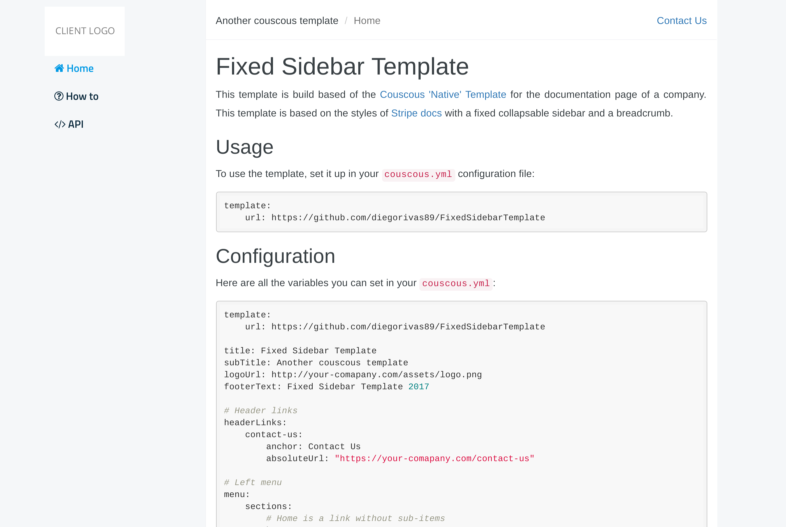

# Fixed Sidebar Template

This template is build based of the [Couscous 'Native' Template](https://github.com/pnowy/CouscousNativeTemplate) for the documentation page of a  company. This template is based on the styles of [Stripe docs](https://stripe.com/docs) with a fixed collapsable sidebar and a breadcrumb.



## Usage

To use the template, set it up in your `couscous.yml` configuration file:

```yaml
template:
    url: https://github.com/diegorivas89/FixedSidebarTemplate
```

## Configuration

Here are all the variables you can set in your `couscous.yml`:

```yaml
template: 
    url: https://github.com/diegorivas89/FixedSidebarTemplate
    
title: Fixed Sidebar Template
subTitle: Another couscous template
logoUrl: http://your-comapany.com/assets/logo.png
footerText: Fixed Sidebar Template 2017

# Header links
headerLinks:
    contact-us:
        anchor: Contact Us
        absoluteUrl: "https://your-comapany.com/contact-us"

# Left menu
menu:
    sections:
        # Home is a link without sub-items
        home:
            icon: fa-home
            name: Home
            absoluteUrl: /
        # How to has sub-items in the section
        howto:
            icon: fa-question-circle-o
            name: How to
            items:
                vtex:
                    name: Connect VTEX
                    absoluteUrl: /howto/vtex.html
                magento:
                    name: Connect Magento
                    absoluteUrl: /howto/magento.html
                mshops:
                    name: Connect MercadoShops
                    absoluteUrl: /commingsoon.html
        api:
            icon: fa-code
            name: API
            items:
                getting-started:
                    name: Getting Started
                    absoluteUrl: /api/getting-started.html
                users:
                    name: Users
                    absoluteUrl: /api/users.html
                purchases:
                    name: Purchases
                    absoluteUrl: /api/purchases.html
```

Note that the menu sections can contain ```icons```:

```yaml
api:
    icon: fa-code
    name: API
```

## Current section and section item

To set the current section and current section item (i.e. open section and highlighted section item), set the ```currentSection``` and ```currentMenu```
key in the Markdown files:

```
---
currentSection: api
currentMenu: users
---

# Welcome
```
